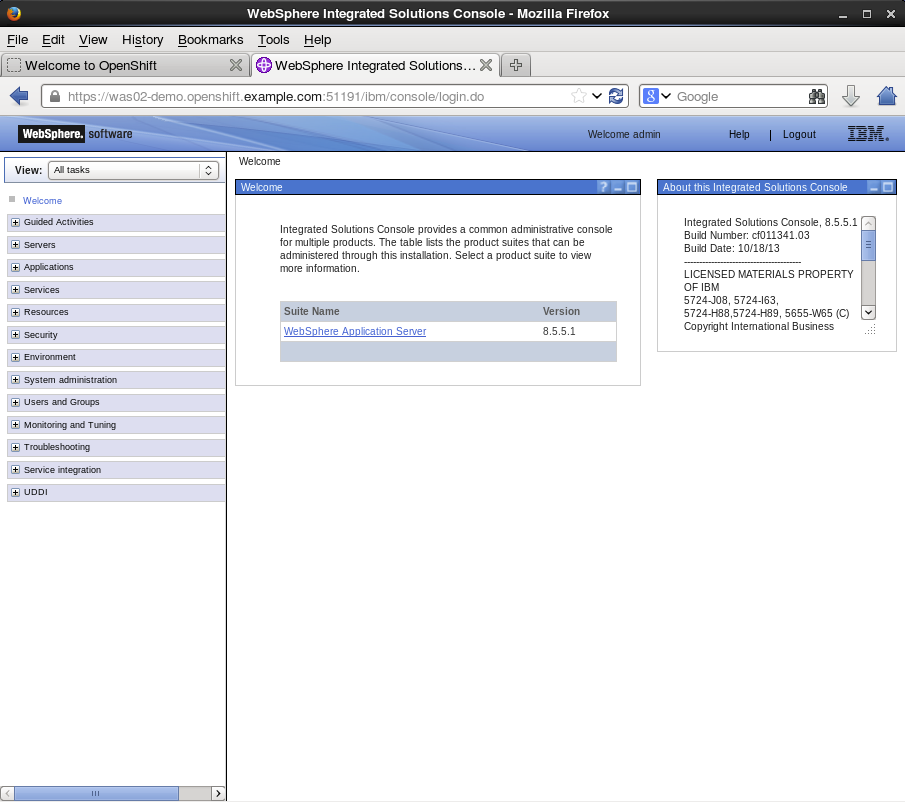

IBM WebSphere Application Server on OpenShift Handbook
======================================================

A. Synopsis
===========

What this is about
------------------
This project represents the source code of the Websphere 8.5.5.1 OpenShift Enterprise cartridge. It is meant to be loaded into OpenShift from source code. There are a few installation steps that are outside OpenShift regarding the installation of IBM's WebSphere but also directory persmissions and SELinux policy enablement.

The cartridge currently supports the following features:

* Provisioning of new IBM WebSphere Application Server instance in minutes
* Full build & Deploy life cycle (as with EAP cartridge)

Screenshots
------------------





B. Installation
===============

1. Setup OSE Environment
------------------------

The setup of the OSE Environment can be accomplished as per your usual way of deploying broker and nodes. This could be via the OSE install script, or any other CM tools like Puppet and Ansible


2. WebSphere Application Server Installation
--------------------------------------------

### IMPORTANT NOTES
In contradiction to the deployment model of other cartridges (that includes all binaries of a certain technology), we've decided not to put the installation files into the cartridge. The reasoning behind:

* IBM WebSphere Application Server Binaries are very large (around 2-3 GB)
* Installation process for the binaries takes takes a long time (up to 15 minutes according to the computing resources)


### Binary Installation
The installation of IBM WebSphere on the filesystem can be done either via the IBM agent installer or any other means that are currently emplyed. The main thing to note here is that profile creation inside the IBM WAS installation would need to be enabled to allow non root users to create them. That is because each gear in OSE will create its own profile and each gear runs as its own UUID and not as root.

### Non-Root permissions
In order to create profiles by non-root users, special file permission settings have to be set on your WebSphere installation. Please follow the steps described here: http://www-01.ibm.com/support/knowledgecenter/SS7JFU_8.5.5/com.ibm.websphere.express.doc/ae/tpro_nonrootpro.html?lang=en

We have included the setWebSpherePermissionsForNonRootProfileCreation.sh that sets basic file permissions on the diretories that gears would require to access. 

###SELinux Permissions

With SELinux enabled on the system, we will require that the following group context be set on the IBM WAS AppServer directory. This would ensure that gear that run under the openshift_rw_file_t group context can have read/write permissions to shared directories under IBM WAS. This does not mean that gears will be able to step on each other in these shared dirs since each gear will have ownership of its own files.


3. Customize SELinux Configuration
----------------------------------
Since IBM WebSphere Application is installed outside of the gear's sandbox, you need to customize SELinux permission settings in a way that the installation directory "/path-to/AppServer" can be accessed with read/write.

```
semanage fcontext -a -t openshift_rw_file_t "/path-to/AppServer(/.*)?"
restorecon -R -v /path-to/AppServer/
```

The followng SELinux policy will also have to be included in the node configuraiton installation. This SELinux Policy is required to be able to restart the WAS gears. When it is not there, the WAS gear will not restart, because the Java process is unable to reacquire the ports it needs as SELinux blocks the Java process.

The policy should be packaged inside the WASpol.te file:

```
module WASpol 1.0;

require {
        type proc_net_t;
        type node_t;
        type openshift_t;
        class tcp_socket node_bind;
        class file { read open };
}

allow openshift_t node_t:tcp_socket node_bind;
allow openshift_t proc_net_t:file { read open }
```

The WASpol.te file should be laid down with root level permissions on the file system. Then the SELinunx policy can be laoded with the command:

```semodule -i WASpol.pp```

The SELinux policy should now be laoded. The WASpol.te file is located under the ```usr``` directory.


4. Cartridge Installation
-------------------------
The cartridge can be installed as any other  OSE cartridge. However, you MUST have to make sure that WebSphere Application Server has been installed before (as described in the preceding sections):

Extract the zipped source code of the WAS cartridge under ```/usr/libexec/openshift/cartridges```

You will also need to set the correct SELinux Context on the cartridge so that it is consitent with the rest of the cartridges on each node. This file context is:

``` system_u:object_r:bin_t:s0 ```

To set this context run the following command:

```chcon -R -u system_u /usr/libexec/openshift/cartridges/ose2-was-frb-cart-frb-was/```

On each OpenShift node where you wish to make this cartridge available execute the following commands:

```
cd /usr/libexec/openshift/cartridges
oo-admin-cartridge --action install --recursive --source /usr/libexec/openshift/cartridges
```

To make the cartridge available run this commmand from the broker:

```oo-admin-ctl-cartridge --activate -c import-node node.hostname```

B. Administration and configuration
===================================

Configure a custom installation location for IBM WebSphere Application Server
-----------------------------------------------------------------------------
This cartridge needs an existing installation of the WebSpehere Application Server on each of your nodes. You need to define the location of the installation through a system wide environment variable

```
echo "/path-to/AppServer" > /etc/openshift/env/OPENSHIFT_WEBSPHERE_INSTALL_LOCATION
```

this will make sure that the cartridge finds the necessary components.


Configure non-root file permissions
-----------------------------------
The file permissions of your WebSphere installation must be set to allow non-root profile creation (see official IBM documentation: http://www-01.ibm.com/support/knowledgecenter/SS7JFU_8.5.5/com.ibm.websphere.express.doc/ae/tpro_nonrootpro.html?lang=en). This has to be done once per binary installation. You can use the following script as a basis for automating this: "usr/setWebSpherePermissionsForNonRootProfileCreation.sh"


How profile creation works
--------------------------
This cartridge will call `${OPENSHIFT_WEBSPHERE_DIR}/install/bin/manageprofiles.sh` and create a profile with the name of the OpenShift app that the user created followed by the domain space name. The final format looks like: "APPNAME-DOMAIN-FQDN-GEAR_UUID" . The profile will be created underneath the `profile` directory inside your gears `data` directory.


Access to WebSphere Admin Console
---------------------------------
PREFFERED - Option 1) After you have created your gear, do a `rhc port-forward <GEAR_NAME>` and open a browser with the following URL `https://<YOUR_LOCAL_IP>:9043/ibm/console`.

Option 2) The Admin Console is also exposed via a separate external port that can be determined as follows:

```
rhc ssh <GEAR_NAME>
export | grep WC_ADMINHOST_SECURE_PROXY_PORT
```

Now point your browser to the following URL: `https://<GEAR_DNS>:<WC_ADMINHOST_SECURE_PROXY_PORT>/ibm/console/logon.jsp` and enter your credentials. Unfortunately the Admin Console tries to redirect us to the local port 9043. 

Now manually change port 9043 back to WC_ADMINHOST_SECURE_PROXYPORT and change login.jsp to login.do so that the URL looks like follows: `https://<GEAR_DNS>:<WC_ADMINHOST_SECURE_PROXY_PORT>/ibm/console/login.do?action=secure`.

The Admin Console should then appear.


C. Reference Information
========================

WebSphere specific
------------------
* Command reference "manageprofiles.sh" - http://pic.dhe.ibm.com/infocenter/wasinfo/v8r5/topic/com.ibm.websphere.express.doc/ae/rxml_manageprofiles.html
* Disable Security HTTPS for Web App - http://www-01.ibm.com/support/docview.wss?uid=swg21408274
* Configure WebSphere to bind to specific IP - http://www-01.ibm.com/support/knowledgecenter/SSAW57_8.5.5/com.ibm.websphere.nd.doc/ae/trun_multiplenic.html?lang=en
* WebSphere Global Deployment Settings - http://www-01.ibm.com/support/knowledgecenter/SS7JFU_8.5.5/com.ibm.websphere.express.doc/ae/urun_app_global_deployment.html?lang=en
* File Permissions for non-admin install - http://www-01.ibm.com/support/knowledgecenter/SS7JFU_8.5.5/com.ibm.websphere.express.doc/ae/tpro_nonrootpro.html?lang=en


OpenShift specific
------------------
* Cartridge Developers Guide - http://openshift.github.io/documentation/oo_cartridge_developers_guide.html
* How to expose more than one public port - https://github.com/sosiouxme/diy-extra-port-cartridge/tree/ssl-hack and https://www.openshift.com/content/at-least-one-port-for-external-use-excluding-8080-please
* WebSphere Liberty Cartridge - https://github.com/WASdev/cloud.openshift.cartridge.wlp

