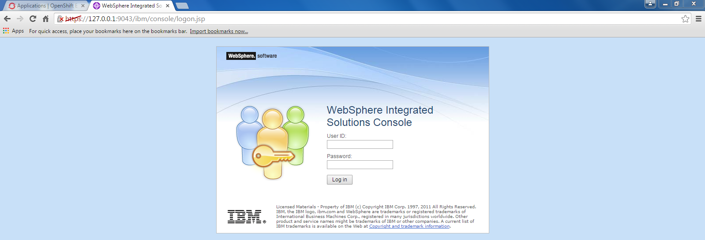

= {subject}: PREPARED FOR - {customer}
:subject: WebSphere Cartridge Installation Guide
:description: WebSphere OpenShift 2 Cartridge Installation
:doctype: book
:confidentiality: Confidential
:customer:  FRIT
:listing-caption: Listing
:toc:
:toclevels: 6
:sectnums:
:chapter-label:
:icons: font
ifdef::backend-pdf[]
:pdf-page-size: A4
:title-page-background-image: image:../usr/doc/header.jpeg[pdfwidth=8.0in,align=center]
:pygments-style: tango
:source-highlighter: coderay
endif::[]

= History and Revisions

[cols=4,cols="1,2,3,4",options=header]
|===
|Version
|Date
|Authors
|Changes


|0.5
|10/08/2015
|Toufic Arabi tarabi@redhat.com
|Initial Draft

|===

== Synopsis

The purpose of this document is to present the guidance to install and configure WebSphere 8.5 OpenShift Enterprise V2.2 cartridge. It is meant to be loaded into OpenShift from source code.
There are a few installation steps that are outside OpenShift regarding the installation of IBM's WebSphere but also directory permissions and SELinux policy enablement.

The cartridge currently supports the following features:

* Provisioning of new IBM WebSphere Application Server instance in minutes
* Full build & Deploy life cycle (as with EAP cartridge)

== Installation

=== Setup OSE Environment

The setup of the OSE Environment can be accomplished as per your usual way of deploying broker and nodes. This could be via the OSE install script, or any other CM tools like Puppet and Ansible

=== WebSphere Application Server Installation

[%hardbreaks]
NOTE: In contradiction to the deployment model of other cartridges (that includes all binaries of a certain technology), we've decided not to put the installation files into the cartridge.
The reasons for these decisions are:
* IBM WebSphere Application Server Binaries are very large (around 2-3 GB)
* Installation process for the binaries takes takes a long time (up to 15 minutes according to the computing resources)

==== Binary Installation
The installation of IBM WebSphere on the filesystem can be done either via the IBM agent installer or any other means that are currently employed.
The main thing to note here is that profile creation inside the IBM WAS installation would need to be enabled to allow non root users to create them.
That is because each gear in OSE will create its own profile and each gear runs as its own UUID and not as root.

==== Disable Existing WebSphere Services
If there are any WebSphere containers that are running on the system, then they should be shut down.

Any WebSphere service that was setup on the machine where the WebSphere cartridge is to be installed need to be turned off. This can be done by removing the
following links and turning off the setup service in *chkconfig*

. Remove the links that are created for the was service

  find /etc/rc* -name *was

. Remove all the links that were obtained from the result of the command above with the following command:

  unlink <link-name>

. Finally, turn off the WebSphere service via *chkconfig* so that it is not started on startup:

  chkconfig <websphere-service-name> off


==== Non-Root permissions
In order to create profiles by non-root users, special file permission settings have to be set on your WebSphere installation. Please follow the steps described here:

http://www-01.ibm.com/support/knowledgecenter/SS7JFU_8.5.5/com.ibm.websphere.express.doc/ae/tpro_nonrootpro.html?lang=en[WebSphere Non Root Permissions Configuration]

We have included the `setWebSpherePermissionsForNonRootProfileCreation.sh` that sets basic file permissions on the directories that gears would require to access.

==== SELinux Permissions & IPv6

With SELinux enabled on the system, we will require that the following group context be set on the IBM WAS AppServer directory.
This would ensure that gear that run under the `openshift_rw_file_t` group context can have read/write permissions to shared directories under IBM WAS. This does not mean
that gears will be able to step on each other in these shared directories since each gear will have ownership of its own files.

===== Set SELinux Context for WebSphere

Since IBM WebSphere Application is installed outside of the gear's sandbox, you need to customize SELinux permission settings in a way that the installation directory "/path-to/AppServer" can be accessed with read/write.

```
semanage fcontext -a -t openshift_rw_file_t "/path-to/AppServer(/.*)?"
restorecon -R -v /path-to/AppServer/

```

===== Disable IPv6

If there are no requirements to use IPv6 on your system, then we recommend disabling it. Keeping IPv6 enabled in OpenShift 2 will cause the WebSphere gears to not be
restarted properly, and in some scenarios, not restarted at all. If IPv6 is a requirement then we recommend you work with Red Hat support to create an SELinux policy that accomodates this use case.

Disabling IPv6 is a three step process:

. Create a file `/etc/modprobe.d/ipv6.conf` with the following contents:

  options ipv6 disable=1

[start=2]
. For completeness, it is a good idea to configure the ip6tables service not to start at boot by issuing the following command:

  chkconfig ip6tables off

[start=3]

. Additionally to prevent `rpc.nfsd` setting up IPv6 sockets while NFS server is running, edit /etc/netconfig for the lines starting with udp6 and tcp6; change the "v" in the
third column to "-"(hyphen/dash)

[start=4]

. Safe reboot the box


== Cartridge Installation

The cartridge can be installed as any other  OSE cartridge. However, you MUST have to make sure that WebSphere Application Server has been installed before (as described in the preceding sections):

Extract the zipped source code of the WAS cartridge under

`/usr/libexec/openshift/cartridges`

You will also need to set the correct SELinux Context on the cartridge so that it is consistent with the rest of the cartridges on each node. This file context is:

`system_u:object_r:bin_t:s0`

To set this context run the following command:

`chcon -R -u system_u /usr/libexec/openshift/cartridges/ose2-was-frb-cart-frb-was/`

On each OpenShift node where you wish to make this cartridge available execute the following commands:

```
cd /usr/libexec/openshift/cartridges
oo-admin-cartridge --action install --recursive --source /usr/libexec/openshift/cartridges
```


To make the cartridge available run these commands from the broker:

```
oo-admin-broker-cache -c
oo-admin-ctl-cartridge --activate -c import-node node.hostname

```
This cartridge needs an existing installation of the WebSphere Application Server on each of your nodes. You need to define the location of the installation through a system wide environment variable

```
echo "/path-to/AppServer" > /etc/openshift/env/OPENSHIFT_WEBSPHERE_INSTALL_LOCATION
```

The cartridge keys off this global OpenShift environment variable to know where the WAS binaries are located so that it may create a profile for each gear created.

== MCollective & OpenShift Console Timeouts

The WebSphere cartridge creates a unique profile for every gear as described in following sections. The profile creation is also followed by enabling global security on the WebSphere gear. The profile creation
and global security enablement can take around 6-8 minutes meaning that it will take longer than the usual cartridges that ship with OpenShift Enterprise, such as JBoss.

The duration discussed above causes the Red Hat Client Tools and the OpenShift Admin Console to show timeout errors when creating WebSphere gears. While the timeout occurs the gears still create in the background
and will be available at the end.

There are a few changes that we can make in OpenShift so that these timeouts do not occur, and so that users can maintain a friendly experience. These values are listed below.

=== MCollective Timeouts


. On the broker change the `MCOLLECTIVE_TIMEOUT` from *240* to *720* in `/etc/openshift/plugins.d/openshift-origin-msg-broker-mcollective.conf`

[start=2]

. On the broker add the `ProxyTimeout 720`  directive in `/etc/httpd/conf.d/000002_openshift_origin_broker_proxy.conf` as the last directive in the `:80` & `:443` Vhost configurations.

[start=3]
. On the node, change the `:timeout => 360` to `:timeout => 720` in the `/opt/rh/ruby193/root/usr/libexec/mcollective/mcollective/agent/openshift.ddl` file.

NOTE: The *openshift.ddl* file is susceptible to be overwritten during a *yum update* of the node so extra care must be take to keep the file with the right configuration.

=== OpenShift Console Timeouts

The console timeout is controlled via a Ruby file and is only set by default to 240 seconds. We need to increase the console timeout to accomodate for the WebSphere cartridge so that users using the console
do not get timeout errors. It is worth noting that if this value is not increased, and if users use the console and receive the warning, OSE will continue to create the WebSphere gear.

To increase the timeout locate the

`/opt/rh/ruby193/root/usr/share/gems/gems/openshift-origin-console-1.35.2.1/app/models/rest_api/base.rb`

and change the `self.read_timeout = 240` to `self.read_timeout = 720`

Restart the OpenShift broker and OpenShift console services on the broker.


== Administration and configuration

=== How profile creation works

This cartridge will call `${OPENSHIFT_WEBSPHERE_DIR}/install/bin/manageprofiles.sh` and create a profile with the name of the OpenShift app that the user created followed by the domain space name.
The final format looks like: "APPNAME-DOMAIN-FQDN-GEAR_UUID" . The profile will be created underneath the `profile` directory inside your gears `data` directory.

It is very important for the non-root users to be configured to be allowed the necessary permissions to create profiles so that profile creation from within the cartridge can occur.

=== Access to WebSphere Admin Console

The WebSphere Administration Console can be accessed via the *port-forward* that ships with the Red Hat Client Tools once a WebSphere application has been created:

. After you have created your gear (application), do an `rhc port-forward <APP_NAME>`
and open a browser with the following URL:

```
  https://127.0.0.1:9043/ibm/console/logon.jsp
```
[start=2]
. The Admin Console should then present a username and password challenge as per the figure below. Enter your AD (windows login) credentials to login



== Reference Information

*WebSphere*

* http://pic.dhe.ibm.com/infocenter/wasinfo/v8r5/topic/com.ibm.websphere.express.doc/ae/rxml_manageprofiles.html[Command reference "manageprofiles.sh"]
* http://www-01.ibm.com/support/docview.wss?uid=swg21408274[Disable Security HTTPS for Web App]
* http://www-01.ibm.com/support/knowledgecenter/SSAW57_8.5.5/com.ibm.websphere.nd.doc/ae/trun_multiplenic.html?lang=en[Configure WebSphere to bind to specific IP]
* http://www-01.ibm.com/support/knowledgecenter/SS7JFU_8.5.5/com.ibm.websphere.express.doc/ae/tpro_nonrootpro.html?lang=en[File Permissions for non-admin install]


*Red Hat Linux & OpenShift V2*

* https://access.redhat.com/solutions/8709[Disabling IPv6 On RHEL 6]
* http://openshift.github.io/documentation/oo_cartridge_developers_guide.html[Cartridge Developers Guide]
* https://www.openshift.com/content/at-least-one-port-for-external-use-excluding-8080-please[How to expose more than one public port in cartridge]
