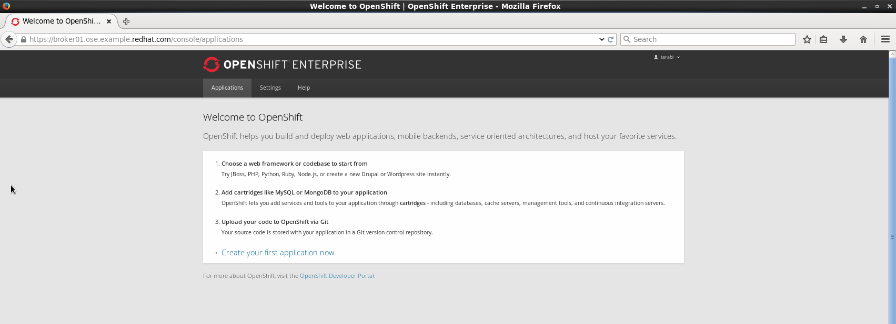

= FRIT WebSphere Cartridge User Guide

= A. Synopsis

The purpose of this document is to present how OpenShift 2 users can interact with the WebSphere 8.5.5.1 OpenShift Enterprise V2.2 cartridge. By the end of this document
users that have the WebSphere cartridge enabled for them will be able to provision WebSphere servers in a matter of minutes.

The end result of their OpenShift 2 WebSphere gear provisioning would be a WebSphere console that gives them full administrative rights over their WebSphere servers.

Each WebSphere server is contained in an OpenShift gear which means that collocated WebSphere users are segregated from one another. The figure below shows
the WebSphere administrative console that every users will obtain.
[[img-console]]
image::../usr/doc/was-admin-console.png[caption="Figure 1: ", title="WebSphere Administration Console in OpenShift"]

<<<

= B. OpenShift 2 WebSphere Gear Creation:

There are two ways to create a WebSphere gear in OpenShift 2:

1. Via the OpenShift Console
2. Via the OpenShift Client Tools

The following sections will present how each of these methods can be used to create a WebSphere gear in OpenShift 2

== Creating WebSphere Gear Via the OpenShift Console:

:sectnums:
The steps to create a WebSphere gear via the OpenShift console are very straightforward:

=== Login to the OpenShift Console as per the image below:

NOTE: OpenShift can be configured with various identity stores. Check with your organization's administrator to find out your login credentials.
[[img-console-login]]

=== Click on "Create Your First Application Now"

NOTE: This step assumes that the user has already created a namespace, and has setup his public key in his OpenShift account.

The next page that is displayed should show the list of all the cartridges that are available. The name of the cartridge might be
different between this document and what you are seeing, therefore make sure that you select the one that hints to WebSphere.

NOTE: OpenShift can be configured with various identity stores. Check with your organization's administrator to find out your login credentials.
[[img-cartridges-menu]]
image::../usr/doc/openshift-cartridges-menu.png[caption="Figure 3: ", title="OpenShift Available Cartridges Menu"]

=== Complete the Application Form

On the next page you will be presented with a form that has a few fields to be completed:

1. The Public URL: This is the name your application will be registered with in DNS. It will have the formate *application_name-namespace.Enterprise_Domain*

2. Source Code: If your application code is stored in a Git repository, you may provide the Git URL and OpenShift will clone the code into the Gear so that the application
is built and ready on gear creation - Not frequently used.

3. Gears: This is the size in memory, disk and CPU that will be given to the application. Each cartridge may be associated wiht one or more gear types. Check your OpenShift administrator
to find out what gear size to choose for the WebSphere cartridge

4. Scaling:

There are two options that you may choose from:

* *No Scaling:* This means that OpenShift will not attempt to spin up identical gears of your applicaiton when its being "hit" with a lot of web traffic
* *Scaling:* Allows OpenShift to create more gears as web traffic increases to your application. This is horizontal scaling. Once the web traffic is reduced, the additional gears are destroyed
and resources are released back to the system.

[[img-application-form]]

=== Create the Application

Once you are done completing the form above, click on *"Create Application"* button. The page will show that it is "working". It will take about
a few minutes before the WebSphere gear is created.
