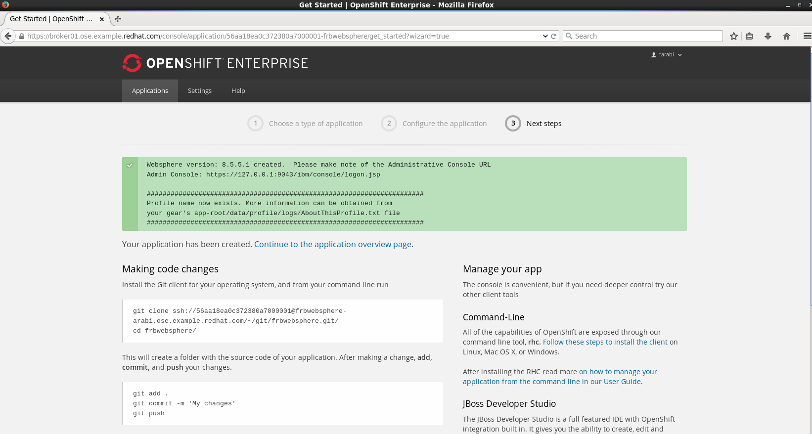

= {subject}: PREPARED FOR - {customer}
:subject: WebSphere Cartridge User Guide
:description: WebSphere OpenShift 2 Cartridge User Guide
:doctype: book
:confidentiality: Confidential
:customer:  FRIT
:listing-caption: Listing
:toc:
:toclevels: 6
:sectnums:
:chapter-label:
:icons: font
ifdef::backend-pdf[]
:pdf-page-size: A4
:title-page-background-image: image:../usr/doc/header.jpeg[pdfwidth=8.0in,align=center]
:pygments-style: tango
:source-highlighter: coderay
endif::[]

= History and Revisions

[cols=4,cols="1,1,3,4",options=header]
|===
|Version
|Date
|Authors
|Changes


|0.5
|10/08/2015
|Toufic Arabi tarabi@redhat.com
|Initial Draft

|===

== Synopsis

The purpose of this document is to present how OpenShift 2 users can interact with the WebSphere 8.5 OpenShift Enterprise V2.2 cartridge. By the end of this document
users that have the WebSphere cartridge enabled for them will be able to provision WebSphere servers in a matter of minutes.

The end result of their OpenShift 2 WebSphere gear provisioning would be a WebSphere console that gives them full administrative rights over their WebSphere servers.

Each WebSphere server is contained in an OpenShift gear which means that collocated WebSphere users are segregated from one another. The figure below shows
the WebSphere administrative console that every user will obtain.
[[img-console]]
image::../usr/doc/was-admin-console.png[caption="Figure 1: ", title="WebSphere Administration Console in OpenShift"]

<<<

== OpenShift 2 WebSphere Gear Creation

There are two ways to create a WebSphere gear in OpenShift 2:

1. Via the OpenShift Console
2. Via the OpenShift Client Tools

The following sections will present how each of these methods can be used to create a WebSphere gear in OpenShift 2

=== Creating WebSphere Application Via the OpenShift Console

:sectnums:
The steps to create a WebSphere gear via the OpenShift console are very straightforward:

==== Login to the OpenShift Console

NOTE: OpenShift can be configured with various identity stores. Check with your organization's administrator to find out your login credentials.
[[img-console-login]]
image::../usr/doc/login-to-console.png[caption="Figure 2: ", title="OpenShift Login Page"]

==== Click on "Create Your First Application Now"

NOTE: This step assumes that the user has already created a namespace, and has setup his public key in his OpenShift account.

The next page that is displayed should show the list of all the cartridges that are available. The name of the cartridge might be
different between this document and what you are seeing, therefore make sure that you select the one that hints to WebSphere.

NOTE: OpenShift can be configured with various identity stores. Check with your organization's administrator to find out your login credentials.
[[img-cartridges-menu]]


==== Complete the Application Form

On the next page you will be presented with a form that has a few fields to be completed:

1. The Public URL: This is the name your application will be registered with in DNS. It will have the format *application_name-namespace.Enterprise_Domain*

2. Source Code: If your application code is stored in a Git repository, you may provide the Git URL and OpenShift will clone the code into the Gear so that the application
is built and ready on gear creation - Not frequently used.

3. Gears: This is the size in memory, disk and CPU that will be given to the application. Each cartridge may be associated wiht one or more gear types. Check your OpenShift administrator
to find out what gear size to choose for the WebSphere cartridge

4. Scaling:

There are two options that you may choose from:

* *No Scaling:* This means that OpenShift will not attempt to spin up identical gears of your applicaiton when its being "hit" with a lot of web traffic
* *Scaling:* Allows OpenShift to create more gears as web traffic increases to your application. This is horizontal scaling. Once the web traffic is reduced, the additional gears are destroyed
and resources are released back to the system.

[[img-application-form]]
image::../usr/doc/openshift-application-form.png[caption="Figure 4: ", title="OpenShift Application Form"]

==== Create the Application & Access the WebSphere Console

Once you are done completing the form above, click on *"Create Application"* button. The page will show that it is "working". It will take about
a few minutes before the WebSphere gear is created.

The OpenShift console will then echo out the details of the WebSphere Administration Console as per the image below.

[[img-console-welcome]]



The WebSphere Administration Console can be access in two ways:

* Option 1: Preferred - After you have created your gear, do an `rhc port-forward <GEAR_NAME>`
and open a browser with the following URL:

```
  https://<YOUR_LOCAL_IP>:9043/ibm/console
```
* Option 2: The Admin Console is also exposed via a separate external port that is echoed upon gear creation in the OSE console.

If the port number has been misplaced it can be re-obtained as follows:

```
  #only include namespace if mutiple apps with same name
  rhc ssh <app-name> [-n <namespace>]
  export | grep WC_ADMINHOST_SECURE_PROXY_PORT
```

[%hardbreaks]
Now point your browser to the following URL:
`https://<GEAR_DNS>:<WC_ADMINHOST_SECURE_PROXY_PORT>/ibm/console/logon.jsp`

The Admin Console should then appear.

=== Creating WebSphere Application with OpenShift Red Hat Client Tools

The second mechanism by why a WebSphere application may be created is via the OpenShift Red Hat client tools that could be installed
on your computer. The commands below assume that a domain space *test* has already been created.

====  Creating WebSphere Application without a Database Add-On

In a terminal window run the below command to create the application *myapp* with the WebSphere cartridge *frb-websphere-8.5*

`rhc app create -a myapp -n mynamespace -t frb-websphere-8.5`

To create a scalable app, you have to add the `-s` option. The namespace `mynamespace` needs to be created before running the above command.
The output below should be seen:

```
[ose@node01 ~]$ rhc app create myapp frb-websphere-8.5
Application Options
-------------------
Domain:     mynamespace
Cartridges: frb-websphere-8.5
Gear Size:  default
Scaling:    no

Creating application 'myapp' ...
```

====  Creating WebSphere Application with a Database Add-On

In the previous section we did not include a database for our application. In this section we demonstrate how this can be done
from the command line.

In a terminal window run the below command to create the application *myapp* with the WebSphere cartridge *frb-websphere-8.5* and an Oracle cartridge *frb-oracle-12.0* as a database add on:

```
rhc app create -a myapp  -n mynamespace -t frb-websphere-8.5 -t frb-oracle-12.0
Application Options
-------------------
Domain:     mynamespace
Cartridges: frb-websphere-8.5, frb-oracle-12.0
Gear Size:  default
Scaling:    no

Creating application 'testkjf01' ... done

  A instance has successfully be configured on the Oracle Database. Please make note of these credentials:

   Script Result: SUCCESS@@oraclesrvr001@@1521@@tcdb_001
        Username: adminin5LXMY
        Password: 5XHV5JB2XteQ
       Tenant ID: tcdb_001

```

To create a scalable app, you have to add the `-s` option. The namespace `mynamespace` needs to be created before running the above command.

The name of the cartridges might vary between this document's version and the current state of the cartridges with regards to versioning, yet the idea remains the same.


== Deploying Applications to WebSphere

All applications deployments should be done via the console. We also strongly recommend that the console is accessed via `rhc port-forward`  when doing deployments.
The following notes only apply to WAS gears that are created in *scaled* mode in OpenShift.

WebSphere comes pre-loaded with a set of default applications. When creating a *scaled* WebSphere gear, OpenShift creates an HA Proxy gear alongside it. When web traffic increases to the main gear
another identical gear is created and more are added as necessary to handle the traffic. This is done automatically and once web traffic decreases, gears are destroyed. The goal of the HA proxy gear is
to direct traffic to the WebSphere gear that can handle it based on Web traffic load.

On initial creation of the scaled WAS gear, the HA proxy gear needs to be aware of an existing context as it performs a health check on its existence. The WebSphere cartridge keys off the `/hello` context
that ships with the `DefaultWebApplication` in WebSphere.

Should developers and administrators decide to remove this default application, they would have to alter the HA Proxy configuration inside their WebSphere gear to reflect a new context that would exist at server startup.
(The root context is a valid context).

*Failure to do so will cause the HA proxy not to start on gear restart, and the deployments to WebSphere not available via their FQDN and context.*

After creating the initial WebSphere gear, SSH into the gear via the RHC client tools or native SSH to the gear as the following:

```
#only include namespace if mutiple apps with same name

rhc ssh <app-name> [-n <namespace>]

OR

ssh <gear-uuid>@app_name-namespace.domain

```

In the WebSphere gear edit the `./haproxy/conf/haproxy.cfg`

Location the `GET /hello` directive and change the `/hello` directive to your new context. For example, if deploying you application to the root context, change the directive to: `GET /`

Restart the WebSphere gear.
